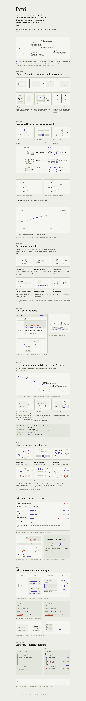

# Petri

Petri's a version tree for AI agent harnesses. A harness is the code around a model:
the prompt, the retry loop, the context it reads. Petri records every change to it :>

Each version in the tree holds three things:

1. A hypothesis in plain English, with the result that would prove it wrong.
2. A benchmark score, measured as the median of 5 runs.
3. Signatures from other keys that re-ran the measurement.

A version is accepted only when 2 other keys re-run it and agree. Rejected versions are
never deleted, so the next agent reads them and does not try the same idea again.




*How Petri works, on one page. The numbers in this explainer are examples. The real recorded tree and its scores are further down, and live at [ethonline2026-two.vercel.app](https://ethonline2026-two.vercel.app/tree/coding--petri-harness-v1--claude-sonnet-5).*

---

## Before and after

Petri started at ETHGlobal Online 2026 with one outside service: a Hedera topic that kept a copy of
the log. For ETHGlobal Tokyo 2026 the Hedera part is gone. ENS now holds the names and the records,
World ID checks the humans, and Intercepta screens the payments. The code from before is at the git
tag `pre-ethtokyo2026`.

| | Before: ETHGlobal Online 2026 | Now: ETHGlobal Tokyo 2026 |
|---|---|---|
| **Public record** | `petri anchor` copied every log line to a Hedera Consensus Service topic. | Every tree, version and check is an ENSv2 subname on Sepolia, under `petri.eth`. Each version's status, score, change, verifiers and token cost are text records. The tree page reads them live. |
| **Version names** | A hash id, like `ecc7cdb0` | An ENS name, like `v2.accepted.claude-sonnet-5.petri-harness-v1.coding.petri.eth`. It moves between the `accepted`, `rejected` and `pending` folders when the status changes. |
| **Who verifies** | Any key that runs `petri verify` | A submitted version opens a 5-minute round. Any wallet joins the pool. Up to 5 verifiers are picked at random by weight, and the seed is on chain, so anyone can replay the pick. |
| **A verifier's vote** | A signed line in the local log | A subname owned by the verifier's wallet. It holds the sealed file key, and only that wallet can write `petri.vote`. The name is burned when the round closes. |
| **Proof of a human** | A simulated Selfie Check on a demo page, and a World AgentBook lookup after `petri verify`, off by default. Both records went to the Hedera topic. | World ID Selfie Check to submit for free, 3 times a day per human. Without it, a 5 USDC stake. World ID for Agents to join a round, with weight 3 instead of 1. The AgentBook lookup after `petri verify` stays, still off by default. |
| **Harness files** | In the repository only | Encrypted on the version's ENS name, as `petri.doc.<file>` records |
| **People pay** | No payments | A person buys an accepted version once, for 1 test USDC. A buyer subname holds the file key, sealed to their browser, for 30 days. |
| **Agents pay** | No payments | An agent buys a version's record as markdown over x402, for 0.01 USDC. Intercepta screens the seller's wallet, the exact typed data and the payer before anything is signed or settled. |
| **Web app** | Tree and Stats | Tree, Stats and Compare, with performance, token savings and speed for every change, and a Buy tab |
| **Recorded tree** | 16 versions: 3 accepted, 2 rejected, 11 pending | 18 versions, `v1` to `v18`: the baseline, 4 accepted, 2 rejected, 11 pending |
| **Tests** | 102 engine tests | 100 engine tests, 55 web tests, and the Intercepta tests |

**What we gave up.** The Hedera topic held a copy of every log line. ENS holds each version's result,
not every line. So the full log is again one file on one machine, guarded by its hash chain.

**What is not done yet.** A round runs on Sepolia from the terminal (`npm run market:smoke`), with no
web page yet. The World ID checks on submit and on join are written, but not yet run with a phone. See
[What is real, and what is not yet](#what-is-real-and-what-is-not-yet).

---

## The problem

1. **Nobody measures.** Teams change a prompt, then say the agent "feels better". There is
   no baseline and no repeat count.
2. **Failures stay private.** A dead end stays in one person's terminal. The next engineer
   tries the same idea again and pays for the same tokens.
3. **Nobody can check a claim.** A reported gain cannot be re-run, because the harness and
   the measurement are not published.

## How Petri answers it

| Problem | What Petri does |
|---|---|
| Nobody measures | Every version runs 20 coding tasks 5 times. The median counts. |
| Failures stay private | Rejected versions stay in the tree with their reason. `petri digest` gives them to the next agent. |
| Nobody can check a claim | A version id is the SHA-256 of its manifest. Other keys re-run both the parent and the version, then sign the result. |

The evolution model:

- **Variation:** a version changes at most 2 files and 120 lines of its parent.
- **Inheritance:** a version starts from its parent's harness files.
- **Selection:** the acceptance rule in `petri/src/policy/acceptance.ts` sets the status.

---

## The acceptance rule

1. A verifier re-runs the parent and the version. Each side runs 5 times.
2. The author's key cannot verify its own version. Two reports from one key count as one.
3. The version is **accepted** when 2 distinct keys each measure at least +1000 basis points.
   (100 basis points = 1%.)
4. At or below -1000 basis points, it is **rejected** as a regression.
5. Between those limits, it is **rejected** as within noise.
6. A version that a guard or the typecheck stopped is never scored. It stays **pending**.

---

## Run it

You need Node and pnpm. No API key is needed.

### The web app

```bash
npm install
npm run dev          # http://localhost:3000
```

1. Open http://localhost:3000.
2. Pick a domain, a model and a harness. The default is Research · Claude Sonnet 5 · Hermes Agent.
3. Open **Coding · Claude Sonnet 5 · Petri harness v1** to see the real tree.
4. Use the **Tree | Stats | Compare** switch to change the view. Compare shows each version on
   performance, token savings and speed.
5. Click an accepted version, connect a wallet at the top right, and open the **Buy** tab to buy it
   once for 1 test USDC.

The Petri harness tree comes from the engine in `petri/`. The page runs `petri export`
and `petri digest` on every request. The other trees are showcase trees. They show how
other domains could look. Nobody measured them.

`npm run test:ens` runs the 55 web tests: the ENS names and records, the market encryption and the zip.

### The engine

```bash
cd petri
pnpm install
pnpm typecheck       # no output means it passed
pnpm test            # 100 tests
pnpm petri tree      # the whole tree, rejected branches included
pnpm petri digest    # what the next agent reads before it proposes a change
pnpm petri dead-ends # every rejected version with its reason
```

---

## The recorded tree

`petri/.petri/` holds 18 versions: 4 accepted, 2 rejected and 12 pending, plus the baseline.
Each version and each verification is one signed line in `petri/.petri/log.jsonl`, and the
statuses are computed from those lines. Each line carries a hash of the line before it, so
Petri refuses a log with an edited line or a gap.

Each version has a number, `v1` to `v18`, in log order. The number is also its ENS label (see below).

| Version | Id | Status | What it tried |
|---|---|---|---|
| v1 | `0a54718a` | baseline | Single-shot prompt, no retry. 5 of 20 tasks. |
| v2 | `ecc7cdb0` | accepted, +7000bp | Full symbol signatures and one worked example. 19 of 20 tasks. |
| v3 | `872aaa3d` | rejected, −7000bp | Removing the signatures and the example again |
| v8 | `ea3b7532` | accepted, +7000bp | Restoring them, one step after the rejected version |
| v13 | `ec1d39e6` | accepted, +7000bp | An independent re-test of signatures and example |
| v14 | `f07e0c55` | rejected, −7000bp | Trimming the prompt again to save tokens |
| v15 | `92dc9c49` | accepted, +7000bp | Restoring the signatures after the trim |
| v16 | `e1adae18` | pending, 1 of 2 keys | A short prompt without the reply-shape block, −7000bp so far |
| v18 | `ae0acec3` | pending, 1 of 2 keys | Restoring the signatures and the example, +7000bp so far |
| v12, v17 | `2e7f6b5b`, `c34b88da` | pending, not scored | Stating every prompt rule as a positive directive |
| v4 to v7, v9 to v11 | | pending, stopped | Changes stopped by a guard or by the typecheck |

All scores are from **replay mode**. Replay runs recorded model answers through the real
sandbox, and the tests really run. It does not call a model.

### Every change is a trade-off

A change is judged on three results against its parent, not one: **performance** (the score),
**token savings** (tokens per task) and **speed** (the time of one benchmark run). All three come
from the runs the other keys re-ran. For example v2 raises the score by 280% but uses 32% more
tokens per task, and v3 saves 24% of the tokens but loses 74% of the score. `lib/metrics.ts`
(`tradeOffOf`) computes them, and `petri.cost` puts the token cost on chain next to the gain.

A change that never ran has no measurement. The site shows an estimate for it
(`estimateTradeOff`): the author's claim on its own direction, and placeholders for the other two.
It is drawn dashed and never counts as data.

---

## Demo: a second key accepts a version

v18 (`ae0acec3`) has 1 verification. One more verification from a different key accepts it.

1. Open http://localhost:3000/tree/coding--petri-harness-v1--claude-sonnet-5.
2. Find v18, "Restoring the full symbol signatures…". It shows `1 of 2 keys`.
3. Run the second verification:

   ```bash
   cd petri
   PETRI_HOME=~/petri-demo-keys/k3 pnpm petri verify ae0acec3
   ```

4. Refresh the page. The version is now accepted and shows purple.

`~/petri-demo-keys/` exists on the machine that built this tree only. On another machine,
create a new key first. Any key that is not the author's key works:

```bash
PETRI_HOME=~/my-verifier pnpm petri id create --label verifier
PETRI_HOME=~/my-verifier pnpm petri verify ae0acec3
```

To reset the tree after a demo:

```bash
git checkout -- petri/.petri
git clean -fd petri/.petri
```

---

## ENS: every version is a name on ENSv2

Every tree, every version and every check is a real subname on ENSv2 (Sepolia), under `petri.eth`.
A tree is domain × harness × model, and its name reads the same way, leaf first. Under each tree
are three folders. A version lives in the folder that matches its status, and the platform moves
it when the status changes.

```
petri.eth                                                     the platform · owner 0xF112…0c06
│
├─ coding.petri.eth                                           the domain
│  └─ petri-harness-v1.coding.petri.eth                       the harness
│     └─ claude-sonnet-5.petri-harness-v1.coding.petri.eth    the tree · petri.v1 … petri.v18 = version ids
│        │
│        ├─ accepted.…                                        the versions that passed, and the baseline
│        │  ├─ v1.accepted.…                                  baseline · 5/20
│        │  ├─ v2.accepted.…                                  19/20 · +7000bp · 2 verifiers · 1141 tokens/task
│        │  │  ├─ buyer1.v2.accepted.…                        owned by the buyer · sealed file key · 30 days
│        │  │  └─ buyer2.v2.accepted.…                        a second purchase · its own 30 days
│        │  ├─ v8.accepted.…
│        │  ├─ v13.accepted.…
│        │  └─ v15.accepted.…
│        │
│        ├─ rejected.…                                        the versions that failed, kept forever
│        │  ├─ v3.rejected.…                                  5/20 · −7000bp
│        │  └─ v14.rejected.…
│        │
│        └─ pending.…                                         the versions still waiting
│           ├─ v4 … v7, v9 … v12, v16, v17                    one name each
│           └─ v18.pending.…                                  1 of 2 keys · encrypted files after a submit
│              └─ round.v18.pending.…                         only while checked · open 5 minutes · pool · seed
│                 ├─ verifier1.round.v18.pending.…            owned by the verifier · sealed key · petri.vote · 10 minutes
│                 └─ verifier2.round.v18.pending.…
│
└─ research.petri.eth
   └─ hermes-agent.research.petri.eth
      └─ claude-sonnet-5.hermes-agent.research.petri.eth       the tree (example data)
         ├─ accepted.…    v1 (baseline)  v2  v3  v5  v8  v10
         ├─ rejected.…    v4  v6  v7  v11  v13
         └─ pending.…     v9  v12
```

Each level is a real ENSv2 subname, in a `UserRegistry` of its own. The registry of a name holds its
children, so the chain of registries is the same as the chain of names:

```
ETHRegistry ──▶ petri.eth registry ──▶ coding registry ──▶ petri-harness-v1 registry ──▶ tree registry
                                                                                           │
                                          accepted / rejected / pending registries ◀───────┘
                                                        │
                            version registry (v2, v18 …) ──▶ round registry ──▶ the verifiers
                                                        └──▶ the buyers
```

One resolver, `0x599F…17eC`, holds the records of every name. When a version's status changes, the
platform burns its name in the old folder and registers it in the new one with the same records:
`v18.pending.…` becomes `v18.accepted.…` or `v18.rejected.…`, and its round and verifiers go with the
old name.

`v<n>` counts versions in log order, so a number never changes. The tree name holds
`petri.v<n>` = the version id, so anyone can look a number up. The baseline `v1` sits in
`accepted`, because every other version is measured against it.

### The records of a version

For example `v2.accepted.claude-sonnet-5.petri-harness-v1.coding.petri.eth`:

| Key | Value |
|---|---|
| `description` | The hypothesis, in the standard key, so any ENS app shows it |
| `petri.id` | The version id (SHA-256 of its manifest) |
| `petri.parent` | The parent version id. Empty on the baseline. |
| `petri.status` | `accepted`, `rejected`, `pending` or `baseline` |
| `petri.score` | `19/20`: tasks passed, median of 5 runs |
| `petri.delta` | `+7000bp`: the change against the parent, measured by other keys |
| `petri.verifier.1`, `petri.verifier.2` | The two keys that re-ran it and counted |
| `petri.cost` | `1141 tokens/task`, so the trade-off is on chain next to the gain |

### A pending version in a round

Only a pending version has names under it. When it is submitted, the platform opens one round:

```
v18.pending.…                              the encrypted files: petri.doc.<file>
└─ round.v18.pending.…                     open 5 minutes · the pool · the random seed
   ├─ verifier1.round.v18.pending.…        owned by the verifier's wallet · sealed file key · vote
   └─ verifier2.round.v18.pending.…
```

1. Anyone with a wallet joins the pool while the round is open. A verifier with a fresh World ID
   approval gets weight 3, without it weight 1.
2. The platform picks up to 5 verifiers at random by weight. The seed is written on the round,
   so anyone can replay the pick.
3. Each picked verifier gets a subname with the file key sealed to their key. They decrypt the
   files, run the version, and write `petri.vote` with their own wallet. Nobody else can write it.
4. The round closes. The verifier names are burned, so their keys stop resolving. The version
   moves to `accepted.…` or `rejected.…`, with the verifiers' wallets in its records.

After that, a user can pay once for an accepted version and get `buyer1.v18.accepted.…`, owned by
their wallet, with the file key sealed to them.

### Who can do what, and for how long

| Name | Who can write it | Expires |
|---|---|---|
| `petri.eth`, the domain, harness and tree names | The platform wallet only | 1 year, renewable |
| `accepted`, `rejected`, `pending` | The platform wallet only | 1 year |
| A version, `v2.accepted.…` | The platform wallet only | 1 year |
| `round.v18.pending.…` | The platform: the pool and the seed | 5 minutes after it opens |
| `verifier1.round.…` | Owned by the verifier's wallet. It alone writes `petri.vote`. It cannot be transferred. | 10 minutes after the pick |
| `buyer1.v18.accepted.…` | Owned by the buyer's wallet. It cannot be transferred. | 30 days |

Every name is registered with no roles, so nobody can transfer it. Every registry names its parent
(`setParent`), and the ENSv2 Universal Resolver walks from `petri.eth` down.

### Buy an accepted version

A user pays 1 test USDC once and gets the harness files. Open an accepted version on the tree,
connect a wallet (top right), and use the **Buy** tab.

1. **Sign** a message in MetaMask. It proves that an access key made in this browser belongs to the wallet.
2. **Pay** 1 USDC (Sepolia MockUSDC) to the platform wallet.
3. The payment is **confirmed** on Sepolia.
4. The platform **checks** the payment: the signature, the amount, the payer, and that the
   transaction was not used before.
5. The **encrypted files** are on the version name, `petri.doc.<file>`. The first buyer of a version
   makes the platform encrypt and publish them. Later buys reuse them.
6. The platform **creates the buyer name**, `buyer<n>.v2.accepted.…`, owned by the buyer's wallet,
   for 30 days.
7. It writes the **file key, sealed to the buyer's access key**, as `petri.key` on that name.
8. The browser **opens the key** and decrypts the files. They download as one zip in the
   `petri/harness` layout.

The page shows all eight steps live: `POST /api/market/buy` streams one JSON line per step, with
each transaction. **Buy again** makes the next buyer name with a fresh 30 days. Nothing is copied:
the files stay once on the version name, and each buy adds one name with three small records
(`petri.wallet`, `petri.access-key`, `petri.key`). Every write pays a tip of at least 3 gwei, so it
lands in the next block.

### How it was set up

The order matters for the explorer, which follows events to find each registry:

1. Deploy the platform resolver (a `PermissionedResolver`) and a `UserRegistry` through the
   `VerifiableFactory`.
2. Register `petri.eth` with the ETH Registrar: commit, wait 60 seconds, register, paid in MockUSDC,
   with **no subregistry** in the call.
3. `setSubregistry` on the .eth registry, then `setParent` on the new registry. Every registry below
   is linked the same way: deploy, `setSubregistry` on the parent, `setParent` back.
4. Register each name with role bitmap 0 (nobody can transfer it) and a 1-year expiry, then write its
   records with the resolver's `multicall`, a few kilobytes per transaction.

| On Sepolia | Address |
|---|---|
| Platform wallet, owns `petri.eth` | `0xF1122BbDb1970aF6eb04a5B43e3864193f050c06` |
| Resolver (every name's records) | `0x599F57D68C77911060B0A64118C5ac9781f117eC` |
| `petri.eth` registry | `0x484fa8c8F4D8aFB5aA45d46c60F90284FD0e729A` |

Three things in the deployed ENSv2 contracts differ from the docs, and each one cost time:

- `setText` takes the name as **DNS-encoded bytes**, not a `bytes32` namehash.
- After `unregister`, a name's records still resolve through its parent's resolver. The close also
  calls `linkToRecord(name, 0)`.
- A resolver role scoped to a text key covers that key on **every** name the resolver serves, not
  one name.

### Run it

```bash
npm run ens:setup       # once: resolver, the petri.eth registry, register petri.eth
npm run ens:tree        # both trees: names, folders, versions, records. Safe to re-run.
npm run market:smoke -- ae0acec3   # one full round on Sepolia: submit, join, pick, vote, close
```

Each needs `PETRI_ENS_PRIVATE_KEY` in `.env.local`, and Sepolia ETH on that wallet. `ens:tree`
writes only what differs from the chain, and moves a version whose status changed.
`market:smoke` works once per pending version: at the end the version is accepted.

### What is real, and what is not yet

| Part | State |
|---|---|
| The two trees, their folders, versions and records on Sepolia | Done. Read live by the tree page. |
| Buy an accepted version, and buy again | Done in the browser, with a real wallet |
| A round: submit, join, random pick, vote, close, move | Done on Sepolia from the terminal (`market:smoke`). No web page yet. |
| World ID on submit (Selfie Check) and on join (World ID for Agents) | The server checks are written. Not yet run with a phone. |

### Limits

- **The ciphertext stays on Sepolia forever.** A buyer or verifier who leaks the file key leaks the
  files. Paying once is a promise, not an enforcement.
- **The access key lives in the browser.** In another browser the buyer cannot open the files, even
  though their wallet paid.
- **The platform wallet holds every role** on the resolver and the registries. It could rewrite any
  record. A contract with narrower roles would remove that trust.
- **The vote role is per text key.** During the vote window a verifier could write `petri.vote` on
  another name. The close revokes it.
- **The random pick runs on the server.** The seed (the round, its pool and the latest block hash)
  is written on the round, so anyone can replay it.

### The explorer

[explorer.ens.dev](https://explorer.ens.dev/petri.eth) shows the owner, resolver and records live
from the chain. Its subname lists and history come from an indexer, `staging-graphql.ens.dev`.
On 2026-09-26 that indexer stopped at Sepolia block 11787289 (16:11 UTC), before `petri.eth` was
registered, so those two parts stay empty until it restarts. The tree page on this site reads every
name through the Universal Resolver and does not depend on it.

The full guide, with the API and every file, is `lib/ens/README.md`.

---

## World ID after each verification

After `petri verify` signs a report, it can check the verifier with World ID. The check
is **off** by default.

```bash
PETRI_WORLD_ID=1 PETRI_WORLD_ADDRESS=0xYourAgentWallet \
  PETRI_HOME=~/my-verifier pnpm petri verify <node>
```

1. The check looks up the wallet in World AgentBook on World Chain.
2. It records the anonymous human id, or the reason there is none, in
   `.petri/world-checks.jsonl`.

The lookup has run against World Chain. Two limits stay:

- The check does not yet prove that the wallet belongs to the key that signed the report.
- It does not change the acceptance rule. A report without a human id still counts.

To register a wallet in AgentBook, run `npm run world:agentkit -- 0xYourAgentWallet`. The web
flows at `/world` (IDKit Selfie Check, World ID for Agents) are explained in `lib/world/README.md`.

---

## Intercepta: an agent buys a version, screened before signing

At `/intercepta` the Petri agent buys a version's record as a **markdown file** over x402, in Circle test
USDC on Ethereum Sepolia: what an agent reads before it builds on that version. It can buy as often as it
likes. Intercepta sits in the payment path on both sides. The walkthrough, in plain English, is
[`docs/intercepta.md`](docs/intercepta.md).

1. The seller answers `GET /api/versions/:versionId/markdown` with HTTP 402: 0.01 USDC to its wallet.
2. Petri checks its own limits first, with no network call: at most 0.50 USDC a payment, Circle USDC
   only, and an authorization valid for at most 300 s.
3. **Intercepta Quick Scan** screens the seller's wallet (`payTo`), before the authorization exists.
4. The x402 scheme builds the EIP-3009 authorization. Petri checks it against the 402, and
   **Intercepta Scan Message** screens the exact typed data. Petri signs only if every check passed.
5. The seller checks the signature, screens the payer with **Quick Scan**, settles on Sepolia, and only
   then sends the file.

Any error, timeout or missing scan **holds** the payment. Nothing is paid by default.

| Seller | What happens | Signed? | Funds moved? |
|---|---|---|---|
| honest | Screened clean, paid 0.01 USDC, settled on Sepolia, file delivered | Yes | Yes |
| rogue | Its wallet is a sanctioned mainnet address: Quick Scan rejects `intercepta_block:sanction_address` | No | No |
| greedy | Asks 0.75 USDC: rejected `over_limit` before any Intercepta request | No | No |

**Preview without screening** shows the agent before this feature: it builds the authorization it
would sign to the rogue wallet, and stops. Every attempt is one line in `petri/.petri/payments.jsonl`.

The same checks guard a second seller that is not on the page: `POST /api/verifier/verify/:versionId`
sells a `petri verify` run by the seller's key (item 3 on Petri's roadmap in `petri/CLAUDE.md`). It sells
once per key per version, because Petri counts one report per key; `&repeat=1` lets a demo buy it again,
and that report does not count.

### Run it

1. Add to `.env.local` (`.env.example` explains each one): `INTERCEPTA_API_KEY`,
   `PETRI_PAY_PRIVATE_KEY` (holds Sepolia USDC from faucet.circle.com, needs no ETH),
   `PETRI_X402_RELAYER_KEY` (a little Sepolia ETH, it settles), and `PETRI_VERIFIER_HOME`.
2. Install the engine and create the verifier's Petri key:

   ```bash
   cd petri && npx pnpm@10 install
   PETRI_HOME=~/petri-verifier npx pnpm@10 petri id create --label verifier
   ```

3. `npm run dev`, open http://localhost:3000/intercepta. Section 1 checks every key and balance
   without spending an Intercepta request.
4. `npm run test:intercepta` runs the decision engine and the agent against a fake verifier and a
   fake Intercepta. No network.

Intercepta has no testnet data. It scores an address by its mainnet history, so the Sepolia payment
is screened as the same address on mainnet, and Scan Message runs under chain id 1.

### Where the Intercepta API is called

| File | Function | Endpoint | When |
|---|---|---|---|
| `lib/intercepta/client.ts` | `quickScanAddress()` | `GET /api/public/v2/extension/account/{address}/quick-scan` | The HTTP call |
| `lib/intercepta/client.ts` | `scanMessage()` | `POST /api/public/v2/extension/analysis/signature` | The HTTP call |
| `lib/pay/agent.ts` | `onBeforePaymentCreation` hook | Quick Scan on `payTo` | Before the authorization is built |
| `lib/pay/agent.ts` | the screening signer's `signTypedData` | Scan Message on the EIP-712 authorization | Before the signature exists |
| `lib/pay/verifier.ts` | `onAfterVerify` hook | Quick Scan on the payer | Before the seller runs the work, settles or sends the file |
| `lib/intercepta/decision.ts` | `decide()` | none: pure | Turns every check into pay, hold or reject |

### Feedback on the Intercepta API

- One `X-API-KEY` header and `.md` doc pages with the OpenAPI inside made the client quick to write. Quick Scan answered in 0.7 to 1.5 s.
- Scan Message documents `message` as a JSON string, but the string form parses nothing and still answers `riskGroup: "Low"`. The object form works. A 400 would be safer than a silent Low.
- Scan Message classifies USDC `TransferWithAuthorization`, the x402 payment primitive, and flags a sanctioned `to` as `High` / `KNOWN_MALICIOUS`. The documented `messageType` enum does not list it. Saying so in the docs would help agent builders.
- The responses differ from the docs: Scan Message answers 201, not 200, and Quick Scan traits leave out the required `txsCount`.
- There are no testnet chain ids. The advice to screen mainnet addresses and the known-risk test addresses are only on the ETHGlobal page and in Discord, not in the API docs.

---

## Add a new version

```bash
cd petri
MODE=replay ./demo/positive-prompt.sh
```

The script proposes a change under `ecc7cdb0` and submits it. In replay mode the change
passes the guards and the typecheck. It is recorded as `not-scored`, because replay holds
recorded answers for 2 harness versions only.

A live run can score a new harness. It needs `ANTHROPIC_API_KEY`:

```bash
ANTHROPIC_API_KEY=... ./demo/positive-prompt.sh
```

The live path has not been run on this tree yet.

---

## What the sandbox enforces

- The harness runs in a child process under Node `--permission`. It can read the prompt
  and the harness files only. It cannot read the tests.
- The generated solution runs in a second child process. The test source is never written to disk.
- A patch that changes more than 2 files or 120 lines, or changes `harness/contract.ts`, is refused.
- `petri verify` refuses a version that was never scored.

## What this does not prove

- **A verifier can sign without running the benchmark.** Nothing compares result hashes
  across verifiers yet.
- **Distinct keys are not distinct people.** One person can create many keys. The World ID
  check is off by default, and it does not yet link a wallet to a signing key.
- **The log is one file on one machine.** Its hash chain catches an edited line or a gap.
  Nothing outside this machine records when each line was written, and the log does not
  show that the benchmark really ran.
- **Replay covers 2 harness versions.** A new harness needs a live run to get a score.
- **The benchmark is 20 tasks.** A gain here may not carry over to other work.
- **Live mode is not deterministic.** The median of 5 runs reduces noise. It does not remove it.

---

## Repository layout

| Path | What it holds |
|---|---|
| `app/`, `components/`, `lib/*.ts` | The Petri web app (Next.js) |
| `lib/showcase.ts` | The showcase trees for other domains |
| `lib/ens/` | ENSv2: each version's name, its text records, and the reader. See `lib/ens/README.md`. |
| `app/ens/`, `app/api/ens/` | The ENSv2 playground on Sepolia, and the ENS API. See `app/ens/README.md`. |
| `scripts/ens-setup.ts` | Registers `petri.eth`, its resolver and registry (`npm run ens:setup`) |
| `scripts/ens-tree.ts` | Puts both trees on ENS and moves versions between folders (`npm run ens:tree`) |
| `lib/market/` | The market: encryption, the round, the pick, votes, the buy, and every ENS write |
| `app/api/market/` | The market API: submit, round (open, join, pick, close), buy, bought, state |
| `scripts/market-smoke.ts` | One full round on Sepolia from the terminal (`npm run market:smoke`) |
| `lib/metrics.ts`, `lib/compare.ts` | The three results of each change, and the Compare view's data |
| `lib/world/` | World: IDKit Selfie Check, World ID for Agents, AgentKit AgentBook. See `lib/world/README.md`. |
| `app/world/`, `app/api/world/` | The `/world` page and the World API |
| `scripts/world-agentkit.ts` | Registers an agent in AgentBook (`npm run world:agentkit`) |
| `lib/intercepta/` | The Intercepta client and the pay, hold or reject decision |
| `lib/pay/` | x402 paid verification: the Petri agent (payer) and the verifier (seller) |
| `app/intercepta/`, `app/api/intercepta/` | The `/intercepta` page and its API |
| `app/api/versions/`, `app/api/verifier/` | The two x402 sellers: a version as markdown, and a verification run |
| `docs/intercepta.md` | How the Intercepta screening works, step by step |
| `petri/` | The engine: CLI, benchmark, harness, recorded tree. See `petri/README.md`. |
| `petri/SPEC.md` | The contract for hashing, signing, the acceptance rule and the CLI |
| `petri/src/consensus/local.ts` | The local log and its hash chain |
| `petri/src/trust/world.ts` | The World ID check after `petri verify` |
| `petri/demo/verify-demo.sh` | The stage demo: verify, then a World ID Selfie Check at `/world` |
