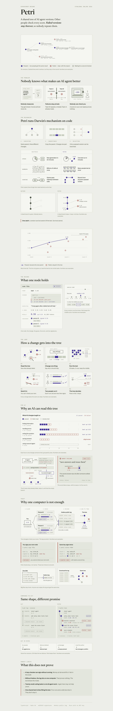

# Petri

Petri's a version tree for AI agent harnesses. A harness is the code around a model:
the prompt, the retry loop, the context it reads. Petri records every change to it :>

Each version in the tree holds three things:

1. A hypothesis in plain English, with the result that would prove it wrong.
2. A benchmark score, measured as the median of 5 runs.
3. Signatures from other keys that re-ran the measurement.

A version is accepted only when 2 other keys re-run it and agree. Rejected versions are
never deleted, so the next agent reads them and does not try the same idea again.




*How Petri works, on one page. The numbers in this explainer are examples. The real recorded tree and its scores are further down, and live at [ethonline2026-two.vercel.app](https://ethonline2026-two.vercel.app/tree/coding--petri-harness-v1--claude-sonnet-5).*

---

## The problem

1. **Nobody measures.** Teams change a prompt, then say the agent "feels better". There is
   no baseline and no repeat count.
2. **Failures stay private.** A dead end stays in one person's terminal. The next engineer
   tries the same idea again and pays for the same tokens.
3. **Nobody can check a claim.** A reported gain cannot be re-run, because the harness and
   the measurement are not published.

## How Petri answers it

| Problem | What Petri does |
|---|---|
| Nobody measures | Every version runs 20 coding tasks 5 times. The median counts. |
| Failures stay private | Rejected versions stay in the tree with their reason. `petri digest` gives them to the next agent. |
| Nobody can check a claim | A version id is the SHA-256 of its manifest. Other keys re-run both the parent and the version, then sign the result. |

The evolution model:

- **Variation:** a version changes at most 2 files and 120 lines of its parent.
- **Inheritance:** a version starts from its parent's harness files.
- **Selection:** the acceptance rule in `petri/src/policy/acceptance.ts` sets the status.

---

## The acceptance rule

1. A verifier re-runs the parent and the version. Each side runs 5 times.
2. The author's key cannot verify its own version. Two reports from one key count as one.
3. The version is **accepted** when 2 distinct keys each measure at least +1000 basis points.
   (100 basis points = 1%.)
4. At or below -1000 basis points, it is **rejected** as a regression.
5. Between those limits, it is **rejected** as within noise.
6. A version that a guard or the typecheck stopped is never scored. It stays **pending**.

---

## Run it

You need Node and pnpm. No API key is needed.

### The web app

```bash
npm install
npm run dev          # http://localhost:3000
```

1. Open http://localhost:3000.
2. Pick a domain, a model and a harness. The default is Research · Claude Sonnet 5 · Hermes Agent.
3. Open **Coding · Claude Sonnet 5 · Petri harness v1** to see the real tree.
4. Use the **Tree | Stats** switch to change the view.

The Petri harness tree comes from the engine in `petri/`. The page runs `petri export`
and `petri digest` on every request. The other trees are showcase trees. They show how
other domains could look. Nobody measured them.

### The engine

```bash
cd petri
pnpm install
pnpm typecheck       # no output means it passed
pnpm test            # 100 tests
pnpm petri tree      # the whole tree, rejected branches included
pnpm petri digest    # what the next agent reads before it proposes a change
pnpm petri dead-ends # every rejected version with its reason
```

---

## The recorded tree

`petri/.petri/` holds 16 versions: 3 accepted, 2 rejected and 11 pending. Each version
and each verification is one signed line in `petri/.petri/log.jsonl`, and the statuses
are computed from those lines. Each line carries a hash of the line before it, so Petri
refuses a log with an edited line or a gap.

| Version | Status | What it tried |
|---|---|---|
| `0a54718a` | pending (the start) | Single-shot prompt, no retry. 5 of 20 tasks. |
| `ecc7cdb0` | accepted, +7000bp | Full symbol signatures and one worked example. 19 of 20 tasks. |
| `872aaa3d` | rejected, -7000bp | Removing the signatures and the example again |
| `ea3b7532` | accepted, +7000bp | Restoring them, one step after the rejected version |
| `f07e0c55` | rejected, -7000bp | Trimming the prompt again to save tokens |
| `92dc9c49` | accepted, +7000bp | Restoring the signatures after the trim |
| `ec1d39e6` | pending, 1 of 2 keys | An independent re-test of signatures and example, +7000bp so far |
| `e1adae18` | pending, 1 of 2 keys | A short prompt without the reply-shape block, -7000bp so far |
| `2e7f6b5b` | pending, not scored | Stating every prompt rule as a positive directive |
| 7 more | pending, not scored | Changes stopped by a guard or by the typecheck |

All scores are from **replay mode**. Replay runs recorded model answers through the real
sandbox, and the tests really run. It does not call a model.

---

## Demo: a second key accepts a version

`ec1d39e6` has 1 verification. One more verification from a different key accepts it.

1. Open http://localhost:3000/tree/coding--petri-harness-v1--claude-sonnet-5.
2. Find "An independent re-test confirms…". It shows `1 of 2 keys`.
3. Run the second verification:

   ```bash
   cd petri
   PETRI_HOME=~/petri-demo-keys/k3 pnpm petri verify ec1d39e6
   ```

4. Refresh the page. The version is now accepted and shows purple.

`~/petri-demo-keys/` exists on the machine that built this tree only. On another machine,
create a new key first. Any key that is not the author's key works:

```bash
PETRI_HOME=~/my-verifier pnpm petri id create --label verifier
PETRI_HOME=~/my-verifier pnpm petri verify ec1d39e6
```

To reset the tree after a demo:

```bash
git checkout -- petri/.petri
git clean -fd petri/.petri
```

---

## ENS: every version's record on its name

Each version has an ENS name under `petri.eth`. The name reads from the version up to the root:

| Version | Name |
|---|---|
| `0a54718a` (the root) | `petriharnessv1.petri.eth` |
| `ecc7cdb0` | `addsigs.petriharnessv1.petri.eth` |
| `872aaa3d` | `dropsigs.addsigs.petriharnessv1.petri.eth` |

The name's resolver holds the version's record as text records. The node panel on the tree page
reads them, and any ENS client can read the same record.

| Key | What it holds |
|---|---|
| `description` | The hypothesis |
| `petri.id`, `petri.parent` | The version id (SHA-256 of its manifest) and its parent's id |
| `petri.status`, `petri.verdict`, `petri.reason` | The status, the engine's code (for example `WIN`) and the reason |
| `petri.score`, `petri.score-source`, `petri.bench` | The score in basis points, where it comes from (`author`, `rerun` or `predicted`), and the number of tasks |
| `petri.delta`, `petri.keys`, `petri.min-keys`, `petri.checks` | The checked change, the counted keys, the keys needed, and each check by another key as JSON |
| `petri.tokens` | Median tokens per task |
| `petri.falsified-if`, `petri.area`, `petri.motif`, `petri.metric`, `petri.mode`, `petri.blocked` | How it could be proven wrong, and its tags |

ENSv2 runs on Sepolia. One resolver on `petri.eth` serves every version name. It stores records per
full name and answers wildcard lookups, so no subname registry is needed.

1. Set up `petri.eth` once in the ENS playground at http://localhost:3000/ens. Mint test USDC and
   deploy your resolver (section 1), register `petri.eth` (section 2), then point it at your
   resolver (section 3).
2. See what would be written. This needs no key:

   ```bash
   npm run ens:publish -- --dry-run
   ```

3. Put the same account's key in `.env.local` as `PETRI_ENS_PRIVATE_KEY`, then write:

   ```bash
   npm run ens:publish
   ```

The script writes only the records that differ from ENS, 60 per transaction, then reads them back.
Run it again after new checks to update the verdicts. Section 8 of `/ens` does the same from a
browser wallet. Until `petri.eth` has a resolver, every lookup comes back empty and the panel
shows the local log.

The full guide, with the API and every file, is `lib/ens/README.md`.

---

## World ID after each verification

After `petri verify` signs a report, it can check the verifier with World ID. The check
is **off** by default.

```bash
PETRI_WORLD_ID=1 PETRI_WORLD_ADDRESS=0xYourAgentWallet \
  PETRI_HOME=~/my-verifier pnpm petri verify <node>
```

1. The check looks up the wallet in World AgentBook on World Chain.
2. It records the anonymous human id, or the reason there is none, in
   `.petri/world-checks.jsonl`.

The lookup has run against World Chain. Two limits stay:

- The check does not yet prove that the wallet belongs to the key that signed the report.
- It does not change the acceptance rule. A report without a human id still counts.

To register a wallet in AgentBook, run `npm run world:agentkit -- 0xYourAgentWallet`. The web
flows at `/world` (IDKit Selfie Check, World ID for Agents) are explained in `lib/world/README.md`.

---

## Intercepta: an agent buys a version, screened before signing

At `/intercepta` the Petri agent buys a version's record as a **markdown file** over x402, in Circle test
USDC on Ethereum Sepolia: what an agent reads before it builds on that version. It can buy as often as it
likes. Intercepta sits in the payment path on both sides. The walkthrough, in plain English, is
[`docs/intercepta.md`](docs/intercepta.md).

1. The seller answers `GET /api/versions/:versionId/markdown` with HTTP 402: 0.01 USDC to its wallet.
2. Petri checks its own limits first, with no network call: at most 0.50 USDC a payment, Circle USDC
   only, and an authorization valid for at most 300 s.
3. **Intercepta Quick Scan** screens the seller's wallet (`payTo`), before the authorization exists.
4. The x402 scheme builds the EIP-3009 authorization. Petri checks it against the 402, and
   **Intercepta Scan Message** screens the exact typed data. Petri signs only if every check passed.
5. The seller checks the signature, screens the payer with **Quick Scan**, settles on Sepolia, and only
   then sends the file.

Any error, timeout or missing scan **holds** the payment. Nothing is paid by default.

| Seller | What happens | Signed? | Funds moved? |
|---|---|---|---|
| honest | Screened clean, paid 0.01 USDC, settled on Sepolia, file delivered | Yes | Yes |
| rogue | Its wallet is a sanctioned mainnet address: Quick Scan rejects `intercepta_block:sanction_address` | No | No |
| greedy | Asks 0.75 USDC: rejected `over_limit` before any Intercepta request | No | No |

**Preview without screening** shows the agent before this feature: it builds the authorization it
would sign to the rogue wallet, and stops. Every attempt is one line in `petri/.petri/payments.jsonl`.

The same checks guard a second seller that is not on the page: `POST /api/verifier/verify/:versionId`
sells a `petri verify` run by the seller's key (item 3 on Petri's roadmap in `petri/CLAUDE.md`). It sells
once per key per version, because Petri counts one report per key; `&repeat=1` lets a demo buy it again,
and that report does not count.

### Run it

1. Add to `.env.local` (`.env.example` explains each one): `INTERCEPTA_API_KEY`,
   `PETRI_PAY_PRIVATE_KEY` (holds Sepolia USDC from faucet.circle.com, needs no ETH),
   `PETRI_X402_RELAYER_KEY` (a little Sepolia ETH, it settles), and `PETRI_VERIFIER_HOME`.
2. Install the engine and create the verifier's Petri key:

   ```bash
   cd petri && npx pnpm@10 install
   PETRI_HOME=~/petri-verifier npx pnpm@10 petri id create --label verifier
   ```

3. `npm run dev`, open http://localhost:3000/intercepta. Section 1 checks every key and balance
   without spending an Intercepta request.
4. `npm run test:intercepta` runs the decision engine and the agent against a fake verifier and a
   fake Intercepta. No network.

Intercepta has no testnet data. It scores an address by its mainnet history, so the Sepolia payment
is screened as the same address on mainnet, and Scan Message runs under chain id 1.

### Where the Intercepta API is called

| File | Function | Endpoint | When |
|---|---|---|---|
| `lib/intercepta/client.ts` | `quickScanAddress()` | `GET /api/public/v2/extension/account/{address}/quick-scan` | The HTTP call |
| `lib/intercepta/client.ts` | `scanMessage()` | `POST /api/public/v2/extension/analysis/signature` | The HTTP call |
| `lib/pay/agent.ts` | `onBeforePaymentCreation` hook | Quick Scan on `payTo` | Before the authorization is built |
| `lib/pay/agent.ts` | the screening signer's `signTypedData` | Scan Message on the EIP-712 authorization | Before the signature exists |
| `lib/pay/verifier.ts` | `onAfterVerify` hook | Quick Scan on the payer | Before the seller runs the work, settles or sends the file |
| `lib/intercepta/decision.ts` | `decide()` | none: pure | Turns every check into pay, hold or reject |

### Feedback on the Intercepta API

- One `X-API-KEY` header and `.md` doc pages with the OpenAPI inside made the client quick to write. Quick Scan answered in 0.7 to 1.5 s.
- Scan Message documents `message` as a JSON string, but the string form parses nothing and still answers `riskGroup: "Low"`. The object form works. A 400 would be safer than a silent Low.
- Scan Message classifies USDC `TransferWithAuthorization`, the x402 payment primitive, and flags a sanctioned `to` as `High` / `KNOWN_MALICIOUS`. The documented `messageType` enum does not list it. Saying so in the docs would help agent builders.
- The responses differ from the docs: Scan Message answers 201, not 200, and Quick Scan traits leave out the required `txsCount`.
- There are no testnet chain ids. The advice to screen mainnet addresses and the known-risk test addresses are only on the ETHGlobal page and in Discord, not in the API docs.

---

## Add a new version

```bash
cd petri
MODE=replay ./demo/positive-prompt.sh
```

The script proposes a change under `ecc7cdb0` and submits it. In replay mode the change
passes the guards and the typecheck. It is recorded as `not-scored`, because replay holds
recorded answers for 2 harness versions only.

A live run can score a new harness. It needs `ANTHROPIC_API_KEY`:

```bash
ANTHROPIC_API_KEY=... ./demo/positive-prompt.sh
```

The live path has not been run on this tree yet.

---

## What the sandbox enforces

- The harness runs in a child process under Node `--permission`. It can read the prompt
  and the harness files only. It cannot read the tests.
- The generated solution runs in a second child process. The test source is never written to disk.
- A patch that changes more than 2 files or 120 lines, or changes `harness/contract.ts`, is refused.
- `petri verify` refuses a version that was never scored.

## What this does not prove

- **A verifier can sign without running the benchmark.** Nothing compares result hashes
  across verifiers yet.
- **Distinct keys are not distinct people.** One person can create many keys. The World ID
  check is off by default, and it does not yet link a wallet to a signing key.
- **The log is one file on one machine.** Its hash chain catches an edited line or a gap.
  Nothing outside this machine records when each line was written, and the log does not
  show that the benchmark really ran.
- **Replay covers 2 harness versions.** A new harness needs a live run to get a score.
- **The benchmark is 20 tasks.** A gain here may not carry over to other work.
- **Live mode is not deterministic.** The median of 5 runs reduces noise. It does not remove it.

---

## Repository layout

| Path | What it holds |
|---|---|
| `app/`, `components/`, `lib/*.ts` | The Petri web app (Next.js) |
| `lib/showcase.ts` | The showcase trees for other domains |
| `lib/ens/` | ENSv2: each version's name, its text records, and the reader. See `lib/ens/README.md`. |
| `app/ens/`, `app/api/ens/` | The ENSv2 playground on Sepolia, and the ENS API. See `app/ens/README.md`. |
| `scripts/ens-publish.ts` | Writes the records to the resolver on `petri.eth` (`npm run ens:publish`) |
| `lib/world/` | World: IDKit Selfie Check, World ID for Agents, AgentKit AgentBook. See `lib/world/README.md`. |
| `app/world/`, `app/api/world/` | The `/world` page and the World API |
| `scripts/world-agentkit.ts` | Registers an agent in AgentBook (`npm run world:agentkit`) |
| `lib/intercepta/` | The Intercepta client and the pay, hold or reject decision |
| `lib/pay/` | x402 paid verification: the Petri agent (payer) and the verifier (seller) |
| `app/intercepta/`, `app/api/intercepta/` | The `/intercepta` page and its API |
| `app/api/versions/`, `app/api/verifier/` | The two x402 sellers: a version as markdown, and a verification run |
| `docs/intercepta.md` | How the Intercepta screening works, step by step |
| `petri/` | The engine: CLI, benchmark, harness, recorded tree. See `petri/README.md`. |
| `petri/SPEC.md` | The contract for hashing, signing, the acceptance rule and the CLI |
| `petri/src/consensus/local.ts` | The local log and its hash chain |
| `petri/src/trust/world.ts` | The World ID check after `petri verify` |
| `petri/demo/verify-demo.sh` | The stage demo: verify, then a World ID Selfie Check at `/world` |
